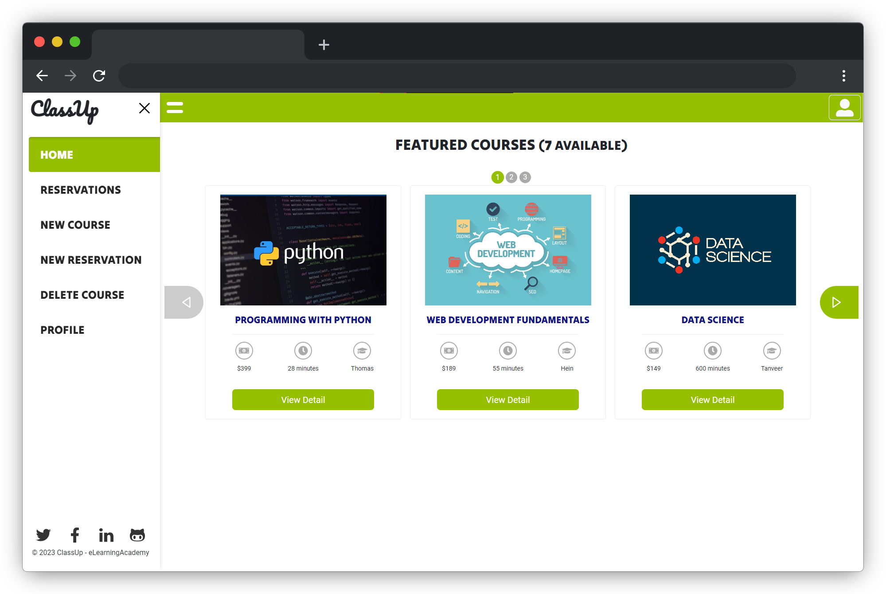
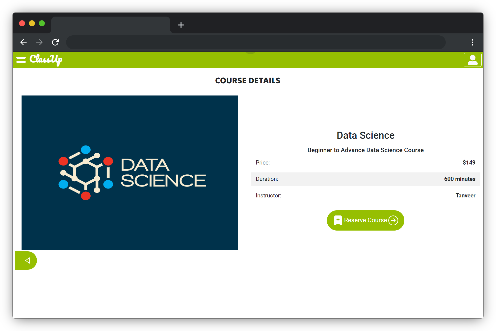
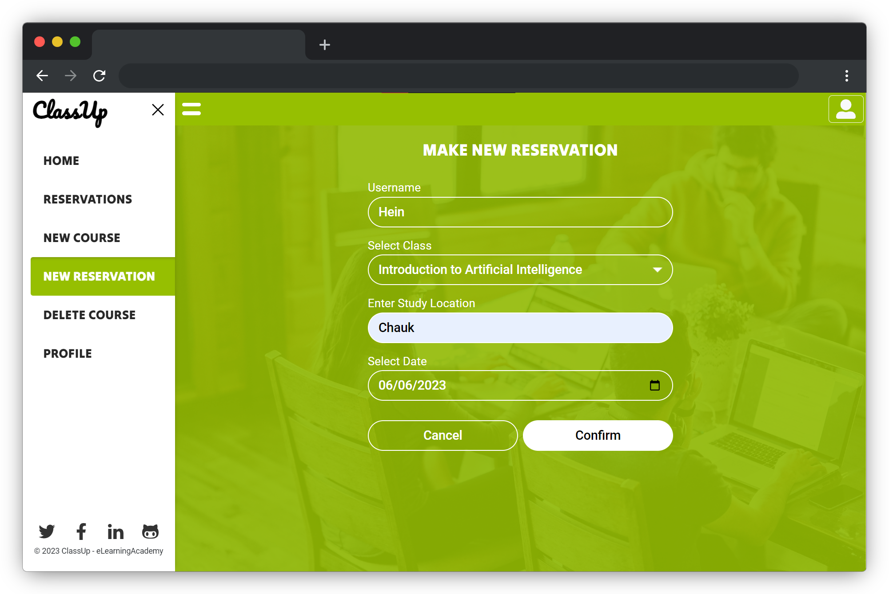
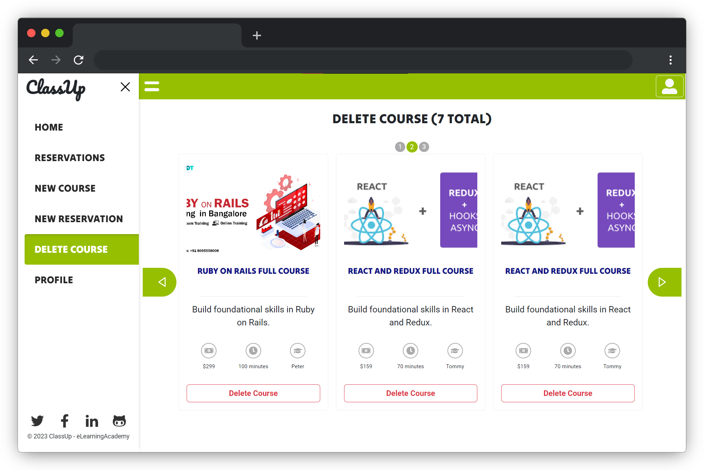
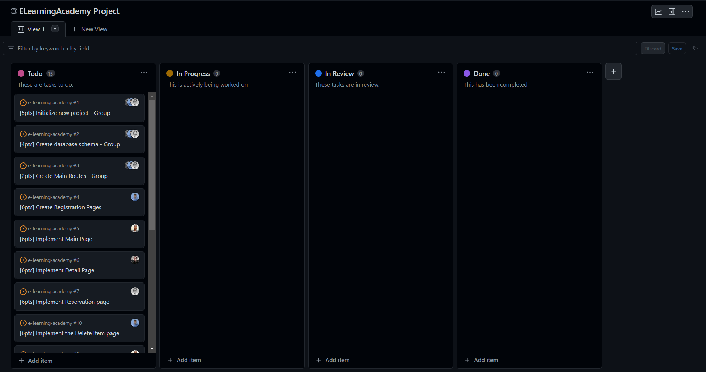

<a name="readme-top"></a>
[](https://github.com/IndieCoderMM/e-learning-academy/graphs/contributors)
[](https://github.com/IndieCoderMM/e-learning-academy/commits/main)
[](https://github.com/IndieCoderMM/e-learning-academy/stargazers)
[](https://github.com/IndieCoderMM/e-learning-academy/issues)
[](https://github.com/IndieCoderMM/e-learning-academy/blob/main/LICENSE)

<details>
<summary>Table of Contents</summary>

- [🎓 ClassUp - Online Learning Platform ](#-classup---online-learning-platform-)
  - [📸 Screenshots ](#-screenshots-)
  - [🚀 Live Demo](#-live-demo)
  - [📋 Kanban Board](#-kanban-board)
  - [🧰 Tech Stack  ](#-tech-stack--)
  - [✨ Key Features  ](#-key-features--)
  - [📘 Getting Started  ](#-getting-started--)
    - [📋 Prerequisites](#-prerequisites)
    - [📂 Setup](#-setup)
    - [📥 Installation](#-installation)
    - [💾 Database](#-database)
    - [💻 Usage](#-usage)
    - [📃 API](#-api)
    - [🧪 Tests](#-tests)
  - [👨‍💻 Authors  ](#-authors--)
  - [🎯 Future Features  ](#-future-features--)
  - [🤝 Contribution  ](#-contribution--)
  - [💖 Show Your Support  ](#-show-your-support--)
  - [🙏 Acknowledgements](#-acknowledgements)
  - [📜 License ](#-license-)
</details>

# 🎓 ClassUp - Online Learning Platform <a name="about-project"></a>

**ClassUp** is a collaborative online learning platform developed as the final capstone project at Microverse. 

Our website allows users to reserve online classes while also providing the opportunity to schedule study sessions with fellow learners in their area. By bridging the gap between virtual learning and real-world interactions, Classup creates a vibrant and collaborative learning environment for students of all backgrounds. 

## 📸 Screenshots <a name="screenshot"></a>

<p>




</p>

<p align="right">(<a href="#readme-top">back to top</a>)</p>


## 🚀 Live Demo

You can checkout the live demo of our project at [classup.onrender.com](https://classup.onrender.com/)

<p align="right">(<a href="#readme-top">back to top</a>)</p>

## 📋 Kanban Board 

We used a Kanban board to manage our tasks and track the progress of our project.

This is [the link to our Kanban Board](https://github.com/users/IndieCoderMM/projects/4).

We're a group of 3 members: [@tobuya](https://github.com/tobuya), [@tanveerisonline](https://github.com/tanveerisonline), [@IndieCoderMM](https://github.com/indiecodermm)



<p align="right">(<a href="#readme-top">back to top</a>)</p>

## 🧰 Tech Stack  <a name="tech-stack"></a>

- **Back-end** 💻: 
  - [Ruby on Rails](https://rubyonrails.org/) - Creating API endpoints and managing databases
  - [PostgreSQL](https://www.postgresql.org/) - Database management system


- **Front-end** 🎨: 
  - [React](https://reactjs.org/) - Building user interfaces
  - [Redux](https://redux.js.org/) - Managing states and API calls
  - [Bootstrap](https://react-bootstrap.github.io/) - Pre-built UI components


- **Tools** 🛠: 
  - [Rspec](https://rspec.info/) - Testing models and requests
  - [RSwag](https://github.com/rswag/rswag) - Documenting and testing API endpoints
  - [Jest](https://jestjs.io/) - Unit tests for frontend components
  - [Webpack](https://webpack.js.org/) - Module bundler for React/javascript
  - [Render](https://render.com/) - Cloud platform for deployment

<p align="right">(<a href="#readme-top">back to top</a>)</p>

## ✨ Key Features  <a name="key-features"></a>

- Browse list of available courses
- Log in with a username and access all features
- Reserve online classes according to preferred time and location
- View upcoming classes and reservations
- Mobile-friendly and responsive design

<p align="right">(<a href="#readme-top">back to top</a>)</p>

## 📘 Getting Started  <a name="getting-started"></a>

To run this project locally, you'll need to follow these steps.

### 📋 Prerequisites

Make sure you have the following installed on your machine:
- [Ruby 3.1.3 or higher](https://www.ruby-lang.org/en/)
- [Rails 7.0.4 or higher](https://rubyonrails.org/)
- [PostgreSQL 15.2 or higher](https://www.postgresql.org/)
- [Node 18.14 or higher](https://nodejs.org/en)

### 📂 Setup

Clone this repository to your desired foler.

```sh
cd my-project
git clone git@github.com:IndieCoderMM/e-learning-academy.git .
```

### 📥 Installation

Install the required gems with:

```sh
bundle install
```

Install the node dependencies with:

```sh
npm install
```

### 💾 Database

Create the databases and run migrations with:

```sh
rails db:create
rails db:migrate
```

To load the sample data, run:

```sh
rails db:seed
```

### 💻 Usage

Build the frontend assets with:

```sh
npm run build
```

To run the development server, execute the following command:

```sh
rails server
```
*Once the server is up and running, you can access the website on  `http://localhost:3000`*

### 📃 API

To read the API documentation, visit `https://localhost:3000/api-docs`

### 🧪 Tests

To run tests, run the following command:

```sh
rspec spec --format doc
```

To test the frontend components, run:

```sh
npm test
```

<p align="right">(<a href="#readme-top">back to top</a>)</p>

## 👨‍💻 Authors  <a name="author"></a>

We worked collectively on both the frontend and backend development, dividing features among us to ensure a well-rounded and efficient system. 

Feel free to reach out to us with your suggestions, ideas, or feedback. We are always eager to improve our website.

👤 **Thomas Obuya**

- GitHub: [@githubhandle](https://github.com/tobuya)
- Twitter: [@twitterhandle](https://twitter.com/MullerTheGreat1)
- LinkedIn: [LinkedIn](https://linkedin.com/in/tobuya)

👤 **Tanveer Ahmad**

- GitHub: [@tanveerisonline](https://github.com/tanveerisonline)
- Twitter: [Tanveer Ahmad](https://twitter.com/Tanveer98589023)
- LinkedIn: [Tanveer Ahmad](https://www.linkedin.com/in/tanveer-ahmad-899462211/)

👤 **Hein Thant**

- GitHub: [@IndieCoderMM](https://github.com/indiecodermm)
- LinkedIn: [@hthantoo](https://linkedin.com/in/hthantoo)
- Gmail: hthant00chk@gmail.com

<p align="right">(<a href="#readme-top">back to top</a>)</p>

## 🎯 Future Features  <a name="future-features"></a>

- [ ] Implement secure *User authentication*
- [ ] Implement *Authorization* (Roles: Admin, Instructor, User)
- [ ] Add *Join-study-sessions Feature*
- [ ] Implement *Edit-courses Feature*
- [ ] Implement *Search Feature*

<p align="right">(<a href="#readme-top">back to top</a>)</p>

## 🤝 Contribution  <a name="contribution"></a>

Contributions, issues, and feature requests are welcome!

<p align="right">(<a href="#readme-top">back to top</a>)</p>

## 💖 Show Your Support  <a name="support"></a>

If you like this project, please consider giving it a ⭐.

<p align="right">(<a href="#readme-top">back to top</a>)</p>

## 🙏 Acknowledgements

This app was designed based on an original design idea by [Murat Korkmaz](https://www.behance.net/muratk) on Behance. 
We would like to thank Murat Korkmaz for this inspiring design.

- [App Design Template](https://www.behance.net/gallery/26425031/Vespa-Responsive-Redesign)

<p align="right">(<a href="#readme-top">back to top</a>)</p>

## 📜 License <a name="license"></a>

This project is [MIT](./LICENSE) licensed.

<p align="right">(<a href="#readme-top">back to top</a>)</p>
